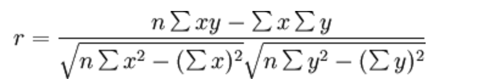

# sklearn数据集使用
    # x数据集的特征值
    # y数据集的标签值
    # test_size测试集的大小，一般为float
    # randon_state随机数种子，不同的种子会造成不同的随机抽样结果。相同种子采样结果相同。
    # return训练集特征值，测试集特征值，训练集目标值，测试集目标值

# Feature engineering特征工程
    # pandas 数据清洗，数据处理
    # 特征抽取/特征提取 机器学习算法->统计方法->数学公式
    # 文本 -> 数值；类型 -> 数值；

### 特征提取
    # sklearn.feature_extraction

### 字典特征提取
    # sklearn.feature_extraction.DicVectorizer(sparse=True)
#### vector向量；矢量
    # 矩阵 matrix 一维数组
    # 向量 vector 二维数组
#### 父类
    # 转换器类
#### 返回sparse矩阵
    # 稀疏矩阵
    # 将非零值按位置表示出来
    # 节省内存 - 提高加载效率
#### 应用场景
    # 1）pclass，sex数据集中类别特征较多    将数据集特征->字典特征    DictVectorizer转换
    # 2）本身拿到的数据类型就是字典类型
#### 文本特征提取
    # 一篇英语短文应该把单词作为特征
    # 句子，短语，单词，字母
    # 特征:特征词
    # 方法一：CountVectorizer   统计每个样本特征词出现的频次  stop_words停用词
    # 在某一个类别的文章中，出现次数多，但其他类别中很少：关键词

    # 方法二：TfidefVectorizer Tf-idf方法：评估一个词在对数据集的重要程度
    # Tf 词频 idf 逆向文档频率
    # sklearn.feature_extraction.text.TfidfVectorizer(Stop_words=None,...)

### 特征预处理
    # 归一化  X'=(x-min)/(max-min)     x''=x'*(xm-mi)+mi
    # 如果出现异常值：最大值or最小值; 归一化由最值得来，鲁棒性较差，只适合传统精确小数据场景
    # sklearn.preprocessing,MinMaxScaler(feature_range+(0,1)...)

    # 标准化  X'=（x-均值)/σ  标准差描述各数据偏离平均数的距离（离均差）的平均数
    # 如果出现异常值，本身数据体量大，少量异常点对平均值影响不大，方差改变较小,较稳定，适大数据背景
    # sklearn.preprocessing.StandardScaler()
### 特征降维
    # 降维：在某些限定条件下，降低随机变量（特征）个数，得到一组"不相干"主变量
    # 两种方法：特征选择 主成分分析（一种特征提取方法）
#### 特征选择
    # 数据中包含冗余或相关变量（或称特征，属性，指标），旨在从原有特征中找出主要特征
    # Filter(过滤式)：主要探究特征本身特点，特征与特征和目标值之间关联
        -方差选择法：低方差特征过滤
            * sklearn.feature_selection.VarianceThreshold(threshold = 0.0)
            
        -相关系数：特征与特征之间的相关程度
            * -1 <= r <= +1
            * 特征与特征之间相关性很高：
                1）选取其中一个
                2）加权求和
                3）主成分分析
            * 主成分分析
                1.sklearn.decomposition.PCA(n_componts=None)
                2.将数据分解为较低维数空间
                3.n_compents:
                    小数：表示保留百分之多少的信息
                    整数：减少到多少特征
                4.PCA.fit_transform(X)      X:numpy array格式数据[n_samples,n_features]
                5.返回值：转换后指定维数的array
    # Embedded（嵌入式）：算法自动选择特征（特征和目标值之间的关联）
        -决策树：信息熵，信息增益   
        -正则化：l1,l2          
        -深度学习：卷积等

#### eg.皮尔逊相关系数

#案例一：探究用户对物品类别的喜好细分
    #用户            #物品类别
    user_id         aisle
    # 需要将user_id和aisle放在同一张表中
    # 找到user_id和aisle的关系——交叉表和透视表
    # 特征冗余——PCA降维

# 分类算法
    # 目标值：类别
    # 1.sklearn转换器和预估器
    # 2.KNN算法
    # 3.模型选择和调优
    # 4.朴素贝叶斯算法
    # 5.决策树
    # 6.随机森林

### 1.sklearn转换器和预估器
    # 转换器（特征工程的父类）       实例化 调用fit
    # 估计器estimator
        1.实例化一个estimator
        2.estimator.fit(x_train,y_train)   fit计算    ——调用完毕，模型生成
        3.模型评估：
            1）直接比对真实值和预测值   y_predict = estimator.predict(x_test)
                                    y_test == y_predict
            2）计算准确率    accruacy = estimator.score(x_test,y_test)
### 2.KNN算法(K近邻算法)
    # 根据与已知类别的邻居的距离推断自己的类别
    # 定义： 如果一个样本在特征空间中的K个最相似（即特征空间中最邻近）
            的样本中的大多数属于某一个类别，那么该样本也属于这个类别
    # 如果k = 1，容易受到异常点影响；若k值过大且样本不均衡，可能分类错误
    # 如何确定谁是邻居？
        （欧式）距离公式：如a（a1,a2,a3）,b（b1,b2,b3）
                        [(a1-b1)^2+(a2-b2)^2+(a3-b3)^2]^(-1)
        （曼哈顿）距离公式：|a1-b1|+|a2-b2|+|a3-b3|
        （明可夫斯基）距离公式：
    # 无量纲化处理，标准化
    # sklearn.neighbors.KNeighborsClassifier(n_neighbors=5,algorithm='auto')
    # 案例：鸢尾花种类预测
        1.获取数据
        2.数据集划分
        3.特征工程 标准化
        4.KNN预估器流程
        5.模型评估
    # 优点：简单，易于理解，易于实现，无需训练
    # 缺点：懒惰算法，对测试样本分类的计算量大，内存开销大且必须指定k值，选择不当损失精度
    # 使用场景：小数据场景
### 3.模型选择和调优
    # 1.交叉验证：将拿到的训练数据，分为训练和验证集
    # 2.超参数搜索-网格搜索
    # sklearn.model_selection.GridSearchCV(estimator,param_grid=None,cv=None)
# 案例：预测facebook签到位置
    # file descriptions
      - train.csv,test.csv
        * row_id:id of the check-in event
        * x y:coordinates
        * accuracy:location accuracy
        * time:timestamp
        * place_id:id of the business,this is the target you are predicting
    # 流程分析：
        1）获取数据
        2）数据处理
        目的：
            特征值
            目标值
            a.time -> 年月日时分秒
            b.过滤签到次数少的地点
        3）特征工程：标准化
        4）KNN算法预估流程
        5）模型选择与调优
        6）模型评估

### 4.朴素贝叶斯算法
    # P(A,B) ; P(A|B) ; P(A,B) = P(A)P(B)
    # 贝叶斯公式 P(C|W) = P(W|C)P(C) / P(W)  
    # 注意：w为给定文档的特征值（频数统计，预测文档给定），c为文档类别
    # 朴素：假设特征与特征之间相互独立
    # 朴素贝叶斯算法：朴素+贝叶斯
    # 应用场景：文本分类，情感分析，单词作为特征
    # 思考：若概率求得为零，合理？
        - 所以引入拉普拉斯平滑系数，为防止计算出的分类概率为零
        - P(F1|C) = （Ni+α）/(N+αm)   α一般为1，m为训练文档中统计出的特征词的个数
    # sklearn.naive_bayes.MultinomialNB(alpha = 1.0)
# 案例：20类新闻分类
    1）获取数据
    2）划分数据集
    3）特征工程
        文本特征抽取
    4）朴素贝叶斯预估器流程
    5）模型调优评估
### 5.决策树
    # 如何高效的进行决策？
    # 特征的先后顺序 
    # 信息论基础：
        - 信息：（香农布朗）消除随机不定性的东西
        - 信息熵
    # 原理：
        - 信息熵，信息增益等（信息论）
        - H的专业术语称为信息熵，单位：比特 H（X）= -（从i到n求和）P（Xi）logbP（Xi）
    # 决策树划分依据之一   ——————   信息增益 最大的准则
        - 特征A对训练集D的信息增益g(D,A),定义为集合D的信息熵H（D）与特征A给定条件下D的信息条件熵H（D|A)之差
            * 公式为：g(D,A) = H(D)-H(D|A)
        - 信息增益比：最大的准则
        - 分类树：基尼系数 最小的准则 在sklearn中可以选择划分的默认原则
        - 优势：划分更加细致
    # class sklearn.tree.DecisionTreeClassifier(criterion='gini',max_depth=None,random_state=None)
        - 决策树分类器
        - criterion：默认是gini系数，也可以选择信息增益的熵entropy
        - max_depth：树的深度大小
        - random_state：随机数种子
    # 决策树可视化：sklearn.tree.export_graphviz()能到处DOT格式
        - tree.export_graphviz(estimator,out_file="tree.dot",feature_names['','']
# 案例：泰坦尼克号生还者预测
    # 